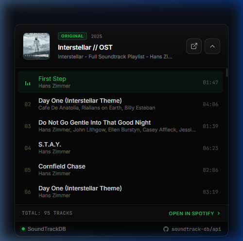

# SoundtrackDB API

<p align="left">
  <a href="https://soundtrackdb.vercel.app"></a>
  <a href="https://soundtrackdb.vercel.app/health"></a>
  <a href="https://soundtrackdb.vercel.app/docs"></a>
  <a href="openapi.json"></a>
  <a href="LICENSE"></a>
</p>

The official developer repository, OpenAPI specification, client recipes, and community feedback hub for **SoundtrackDB** — the REST API mapping IMDb/TMDB titles to verified Spotify soundtrack playlists.

- 🌐 **Live Web Tester:** [soundtrackdb.vercel.app](https://soundtrackdb.vercel.app)
- 📖 **Interactive Documentation:** [soundtrackdb.vercel.app/docs](https://soundtrackdb.vercel.app/docs)
- 📋 **OpenAPI 3.0 Spec:** [openapi.json](./openapi.json)

---

## ⚡ Quickstart (30 Seconds)

Resolve any movie or TV soundtrack instantly with zero API keys required:

### 1. By IMDb ID
```bash
curl -s "https://soundtrackdb.vercel.app/v1/titles/imdb/tt15239678/music"
```

### 2. By Title & Year
```bash
curl -s "https://soundtrackdb.vercel.app/v1/titles/resolve?title=Interstellar&year=2014"
```

### Sample Response
```json
{
  "provider": "SoundTrackDB",
  "creator": "cnf1g & shreyash",
  "success": true,
  "cached": true,
  "title": {
    "imdb_id": "tt15239678",
    "name": "Dune: Part Two",
    "year": 2024,
    "slug": "dune-part-two-2024",
    "type": "movie"
  },
  "soundtrack": {
    "provider": "spotify",
    "title": "Dune: Part Two (Original Motion Picture Soundtrack)",
    "spotify_id": "2Z9bQd8g5C4f4p8kY5",
    "spotify_url": "https://open.spotify.com/playlist/...",
    "track_count": 25,
    "confidence_score": 98
  }
}
```

---

## 🎵 Plug & Play Soundtrack Widget

Drop a responsive, high-polish soundtrack player into any webpage or blog in two lines of HTML — featuring full tracklists and interactive 30-second audio previews:

```html
<!-- 1. Target container with IMDb ID (e.g. Interstellar - tt0816692) -->
<div class="soundtrackdb-widget" data-imdb="tt0816692"></div>

<!-- 2. Drop-in script (zero CSS dependencies, self-mounting) -->
<script src="https://soundtrackdb.vercel.app/widget.js" async></script>
```

<p align="center">
  
</p>

---

## 📂 Developer Recipes & Examples

Explore plug-and-play recipes in the [`examples/`](./examples) directory:

| Language / Framework | Description | Path |
| :--- | :--- | :--- |
| **Plug & Play Widget** | Self-contained embed widget with audio previews | [`examples/javascript/widget-demo.html`](./examples/javascript/widget-demo.html) |
| **Vanilla HTML/CSS Card** | Custom soundtrack card layout with Tailwind | [`examples/javascript/soundtrack-card.html`](./examples/javascript/soundtrack-card.html) |
| **JavaScript / Node.js** | Native `fetch` wrapper (Node 18+ & browser) | [`examples/javascript/fetch-soundtrack.js`](./examples/javascript/fetch-soundtrack.js) |
| **Python** | Zero-dependency client using standard `urllib` | [`examples/python/get_soundtrack.py`](./examples/python/get_soundtrack.py) |
| **cURL** | Bash one-liners and quick queries | [`examples/curl/quickstart.sh`](./examples/curl/quickstart.sh) |

---

## 🛠️ Postman & Insomnia Integration

You can import the SoundtrackDB API specification directly into your HTTP client:

1. Copy the raw link to [`openapi.json`](https://raw.githubusercontent.com/soundtrack-db/api/main/openapi.json).
2. In **Postman** or **Insomnia**, click **Import** ➔ **From URL**.
3. Paste the URL. All endpoints, parameters, and response schemas will be generated automatically.

---

## 🤝 Community Catalog Requests & QA

SoundtrackDB's catalog grows continuously. If you run into a missing soundtrack or notice an incorrect playlist mapping, you can use our structured GitHub issue forms:

- 🎵 **[Request a Missing Soundtrack](https://github.com/soundtrack-db/api/issues/new?template=01_title_request.yml)** — Submit an IMDb ID or movie title for verification and indexing.
- ⚠️ **[Report a Mismatch or Broken Link](https://github.com/soundtrack-db/api/issues/new?template=02_report_mismatch.yml)** — Flag an inaccurate playlist or missing track list.
- 💡 **[Suggest a Feature / Feedback](https://github.com/soundtrack-db/api/issues/new?template=03_feedback.yml)** — Share ideas for client libraries, widgets, or endpoints.

---

## ❓ Frequently Asked Questions

### Is SoundtrackDB free to use?
Yes. The public beta provides 100 requests/minute per IP with zero authentication or API keys required.

### Why isn't the ingestion engine open source?
The specification, documentation, client recipes, and issue tracking are open source and MIT licensed. The ingestion, verification, and live token rotation pipeline is operated as a managed hosted service to guarantee data consistency, prevent scraping abuse, and maintain reliability.

### Can I contribute?
The best way to contribute is by submitting missing titles, reporting inaccurate playlist matches via [GitHub Issues](https://github.com/soundtrack-db/api/issues), or submitting client example PRs.

---

## 📄 License

The documentation, specifications, and example code in this repository are distributed under the [MIT License](./LICENSE).

---

<p align="center">
  Maintained by <a href="https://github.com/justshreyash">shreyash</a> & <a href="https://soundtrackdb.vercel.app">cnf1g</a> · Built for movie & music lovers
</p>
